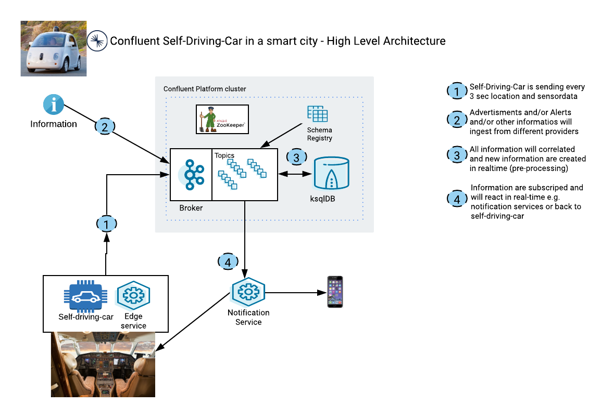

# A conneted self-driving Car in a Smart City with Confluent Kafka
In a smart city the self-driving-car will be sooner then later a common situation. That's why it is important to build a working foundation to enable all the benefits.
The story of this demo is quite simple:
* We simulate a self-driving-car with UDACITY App. This App uses a self-trained model to steer the car. If you want you create your own model `model.5h`. Please follow these [instructions](createModel/Readme.md)
* The App is sending data to the backbone (implemented with Confluent Platform or Apache Kafka). We send location and sensordata. Sensor Data is coming directly from Self-Driving Car App.
* Additionally we have other stakeholders using the backbone to add specific information like advertisements or Alerts e.g. info of an accident. 
* We correlate the information and do bi-directional communication with all stake-holder.
* It shows how easy it is to share information on different channels to give a experience and enable lots of benefits for all stakeholders. 

The next graphic shows the high level architecture of this demo:



Before executing the demo you need to install a couple of things.

## Prereqs - Installation
Before going into detail you have to prepare your environment as followed (I use macos Catalina):
* Have Python 3 running
* install important python modules
* Have confluent cli installed, see [docu](https://docs.confluent.io/confluent-cli/current/installing.html)
* Have Confluent Platform 6.1 running on your machine [Installation Guide](https://docs.confluent.io/platform/current/installation/installing_cp/zip-tar.html#prod-kafka-cli-install)
* Download and unzip UDACITY Simulator. [Download from here](https://github.com/udacity/self-driving-car-sim) and rename the app `SelfDrivingCar-Simulator`.
* have iTerm 2 installed
* have a working notification App on your IoS device. I use Pushover but you can also use Telegram or similar apps

## Install Python Modules
```bash
# Python version should 3.8
python3 --version
# install important moduls to allow execution without error
pip3 install flask
pip3 install python-socketio==2.1.2
pip3 install eventlet
pip3 install opencv-python
pip3 install tensorflow
pip3 install keras
pip3 install Pillow
pip3 install python-engineio==2.2.0
pip3 install pykafka
pip3 install confluent_kafka
# Set Path for Python 3.8
echo 'export PATH="/usr/local/opt/python@3.8/bin:$PATH"' >> ~/.bash_profile
source ~/.bash_profile
```
## Clone this repo
Clone my repository:
```bash
git clone https://github.com/ora0600/connected-selfdrivingcar-in-a-smartcity-with-Confluent-Kafka.git
```
Now, everything is stored for execute this demo.
You need to download Simlulator by yourself following these instructions:
Download Simulator Version 1 from : [UDACITY](https://github.com/udacity/self-driving-car-sim)
```bash
mkdir self-driving-car
cd self-driving-car
wget https://d17h27t6h515a5.cloudfront.net/topher/2016/November/5831f290_simulator-macos/simulator-macos.zip
unzip simulator-macos.zip 
rm  simulator-macos.zip 
# if you want rename the simulator App. Please rename.
# I did use SelfDrivingCar-Simulator, do renaming in MacOS Finder
```
We are simulating a kind of car-cockpit with a navigator app. For this we need token, that's why we have to register at mapbox.com

## Register and get token from mapbox
To use the maps in our demo we need to get access. For this we have to register in mapbox.
You can follow this [youtube video](https://www.youtube.com/watch?v=vD9Ic8KqEDw)
Please register under [mapbox.com](https://account.mapbox.com/auth/signin/?route-to=%22https://account.mapbox.com/access-tokens/%22)
Enter your data, verify your email address and then login into mapbox.com and you will get your public token.
Add your token into `static/leaf.js`: `accessToken: 'ABCD' //ENTER YOUR TOKEN HERE`

## Register to Pushover
If you do not want to use Pushover, then use Telegram. In my github repositories I do have some samples around [Telegram](https://github.com/ora0600/apache-kafka-as-a-service-by-confluent/tree/master/webinar1).
Signup to [Pushover](https://pushover.net/login) you will get free access for a week or so.
* Install PushOver App on you iPhone
* Login into [Pushover](https://pushover.net/login)
* Add your Device
* Create a new Application (enter the name e.g. selfdrivingcar is enough) and copy the token and your user key
* Change token in Python script
Change Python script `push2ios.py`:
```bash
# change 
urllib.parse.urlencode({
            "token": "ABCD",
            "user": "EFGH",
```

## Run Demo

Run the script `00_start_selfdrivingcar_demo.sh` everything will be open automatically.
Want will be opened:
*  SelfDrivingCar-Simulator App: `open -a SelfDrivingCar-Simulator`: Please use 6400*480 resolution and click the button autonomous mode
* python3 drive.py will executed. This Micrsoservice is the edge service within the self-driving-car
* python3 geo_consumer.py will get the information of the self-driving-car (location) and maybe additional infos like Alerts and adverstisements
* python3 push2ios.py will send notification to iPhone 
* chrome window with http://localhost:5001/topic/selfdrivingcar will show the consumer results in webbrower
* chrome window with http://localhost:5001/ is showing the with current location

Now, you can see you car driving alone and you got the location of car driving around the Nürburgring.
Push important notifcations to the app. e.g.
* Special advertisements from the Hotels
* Or Alert e.g. an accident is close to your location.

Do that please ksql (TODO):
```bash
ksql
ksql> INSERT INTO
```

These information will be pushed to your iPhone and to your cockpit of your car.

### enhancements of the setup
Some enhancements. I did place everything on my desk to that every piece of this demo is visible. If this setup is not possible in your own environment, then you have to change `template/index.html`


### additional possibilities

1. you can add your own route close to your neighbourhood if you want. For this add the simluated route into geo.json
    * add your own map view: change `static/leaf.js`and place the viewport `var mymap = L.map('mapid').setView([50.336, 6.94], 15);` with right location point in latitude, longitude
2. Of course you can do a multiplayer mode. For this every player runs its own App including Microservice. The only thing you have to gurantee that each player is using the same Confluent Kafka cluster.

## Stop Demo environment

Exit all terminals with CTRL+c.
Shutdown COnfluent Platform and destroy content:
```bash
confluent local services stop
confluent local destroy
```